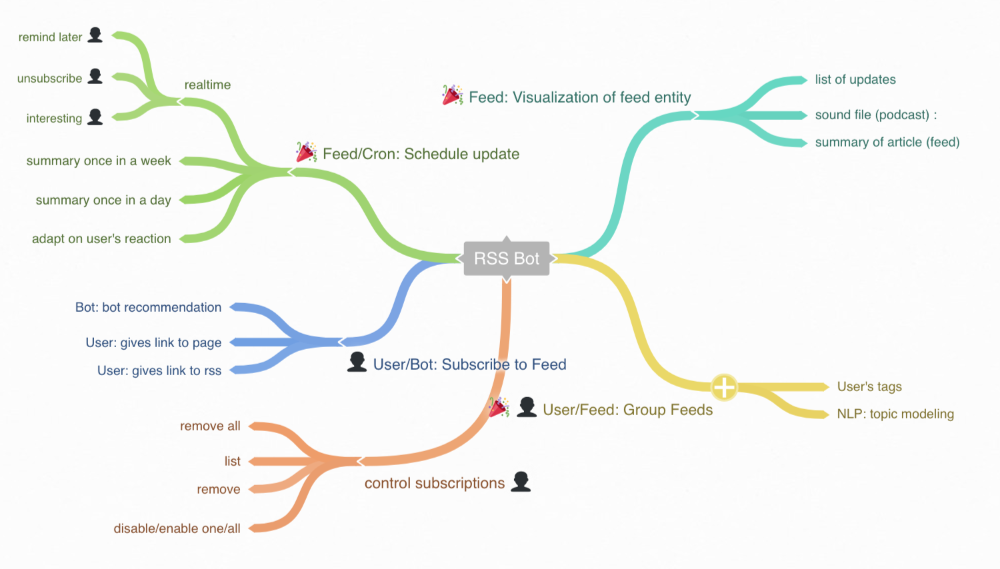

# rss-bot    
rss bot - Too old to die young :godmode:

## Isn't it dead and gone? Current state of RSS

Yes, rss isn't branch a new technology it was there since 1999.
Few years ago there was hype that Twitter killed RSS. But as you will
see RSS is still [here](#Examples) as well as Twitter.

According to
[Wikipedia](https://en.wikipedia.org/wiki/RSS#Current_usage):

> Several major sites such as Facebook and Twitter previously offered
RSS feeds but have reduced or removed support. Additionally, widely
used readers such as Shiira, FeedDemon, and Google Reader have been
discontinued having cited declining popularity in RSS. RSS support was
removed in OS X Mountain Lion's versions of Mail and Safari, although
the features were partially restored in Safari 8. As of August 2015,
Mozilla Firefox and Internet Explorer include RSS support by default,
while Google Chrome and Microsoft Edge do not. Additionally, reader
services such as Feedly provide synchronization between desktop RSS
readers and mobile devices.

Anyway from my point of few it was very cool idea to describe updates of
web page in declarative way. It looks very natural.

Even so there some controversial issues:
* :package: **XML** - in the modern world where we have JSON and YAML XML looks
strange and clumsy

## Where can I get it
### :loudspeaker: podcasts
  - [ ] **[BBC The Science Hour](http://www.bbc.co.uk/programmes/p016tmt2)** [RSS](http://podcasts.files.bbci.co.uk/p016tmt2.rss) podcast about frontier of science in the different topics
  - [ ] **[The Talking Machines](http://www.thetalkingmachines.com/)** [RSS](http://rss.art19.com/talking-machines) podcast about machine learning, moved from soundcloud, what makes in more problematic to subscribe it through sound cloud
### :newspaper: blogs
  - [ ] **[Dr. GP Pulipaka](https://medium.com/@gp_pulipaka/)** [RSS](https://medium.com/feed/@gp_pulipaka) blog about machine learning
  - [ ] **[Google Research Blog](https://research.googleblog.com/)** [RSS](http://googleresearch.blogspot.com/atom.xml)
  - [ ] **[Facebook Research Blog](https://research.fb.com/)** [RSS](https://research.fb.com/feed/)
  - [ ] **[Apple Machine Learning](https://machinelearning.apple.com/)** [RSS]()
  - [ ] **[Open AI Blog](https://blog.openai.com/)** [RSS](https://blog.openai.com/rss/)
  - [ ] **[Tech Crunch about Machine Learning](https://techcrunch.com/tag/machine-learning/)** [RSS](https://techcrunch.com/tag/machine-learning/feed/)

### :speech_balloon: communities
  - [ ] **[Reddit for MachineLearning](https://www.reddit.com/r/MachineLearning/)** [RSS](https://www.reddit.com/r/MachineLearning/.rss)
  - [ ] **[New comments about Canada on Ukraine Developers forum](https://dou.ua/forums/tags/%D0%9A%D0%B0%D0%BD%D0%B0%D0%B4%D0%B0/)** [RSS](https://dou.ua/forums/feed/tag/%D0%9A%D0%B0%D0%BD%D0%B0%D0%B4%D0%B0/)
  - [ ] **[Artificial Network Wikipedia page updates (Revision history)](https://en.wikipedia.org/w/index.php?title=Artificial_intelligence&action=history)** [RSS](https://en.wikipedia.org/w/index.php?title=Artificial_intelligence&feed=atom&action=history)

## :construction: IN PROGRESS: How to use RSS bot?

- start chat with the RSS Bot
- ask her to send you updates about certain page

## :construction: TODO: How messenger could be useful?

## Mindmap of bot

[hosted on coggle](https://coggle.it/diagram/WcgsjGjgVAABxW_M)
